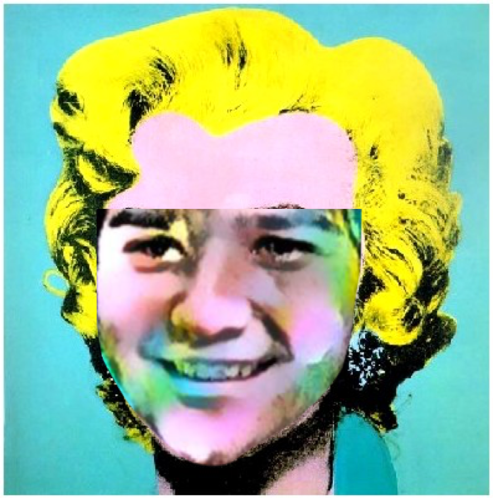
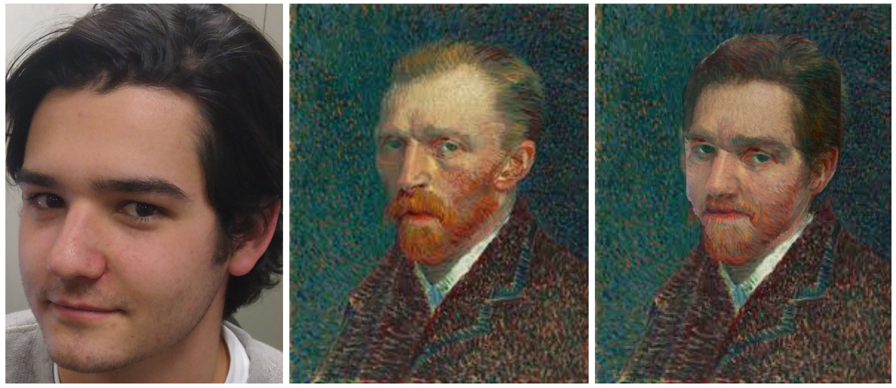

# Artistic-Facial-Replacement

A python implementation combining [Combining Markov Random Fields and Convolutional Neural Networks for
Image Synthesis](https://arxiv.org/pdf/1601.04589.pdf) and a facial recognition software to create 
a realistic synthesis between a photo portrait and a painting portrait. Currently requires excessive
dependencies, instructions for home implementation will be added later.

## Examples

Format: 

Format: 

Format: 
